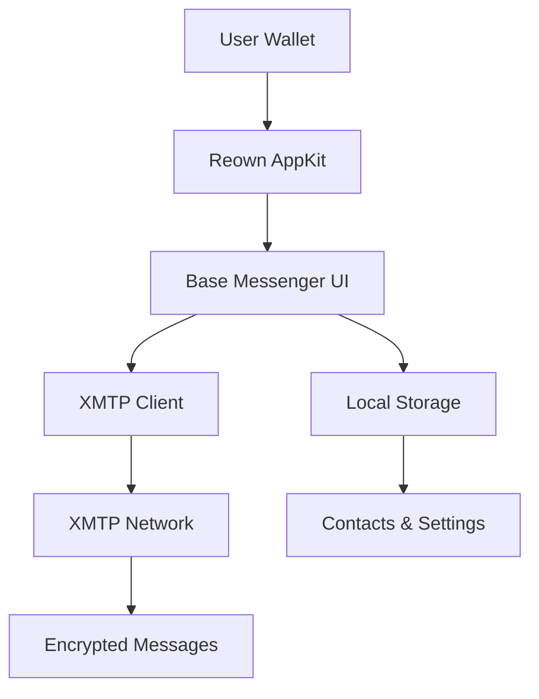

# Base Messenger

<div align="center">

  
  
  
  
  
  
  

  <br />

  <h1>Decentralized Messaging on Base</h1>
  <p><strong>End-to-end encrypted chat powered by XMTP, built for the Base ecosystem</strong></p>

  [Demo](https://base-messenger-demo.vercel.app) • [Documentation](https://docs.base.org) • [Discord](https://discord.gg/base) • [Twitter](https://twitter.com/base)

</div>

---

## Table of Contents

- [Overview](#overview)
- [Features](#features)
- [Screenshots](#screenshots)
- [Architecture](#architecture)
- [Quick Start](#quick-start)
- [Usage](#usage)
- [API Reference](#api-reference)
- [Contributing](#contributing)
- [License](#license)

## Overview

Base Messenger is a modern, decentralized messaging application that brings secure, wallet-based communication to the Base network. Built with React and TypeScript, it leverages XMTP for end-to-end encryption and Reown AppKit for seamless wallet integration.

Unlike traditional messaging apps, Base Messenger uses your Ethereum address as your identity—no phone numbers required. Messages are encrypted on your device and never stored in plaintext on any server.

## Features

- 🔐 **Wallet-First Identity**: Connect with MetaMask, Coinbase Wallet, or any EVM wallet
- 🔒 **End-to-End Encryption**: XMTP protocol ensures messages are secure and private
- 💬 **Real-Time Messaging**: Instant delivery with streaming APIs
- 👥 **Group Chats**: Create and manage group conversations
- 🌐 **ENS Integration**: Resolve Ethereum names for easy addressing
- 📱 **Responsive Design**: Works seamlessly on desktop and mobile
- 🎨 **Modern UI**: Built with Tailwind CSS and shadcn/ui components

## Screenshots

<div align="center">
  
  <p><em>Base Messenger interface showing chat list and conversation</em></p>
</div>

## Architecture



### System Components

- **Frontend**: Single-page React application with Vite build system
- **Wallet Integration**: Reown AppKit for multi-wallet support
- **Messaging Protocol**: XMTP Browser SDK for encryption and delivery
- **State Management**: Zustand for client-side state
- **Styling**: Tailwind CSS with custom design system

## Quick Start

### Prerequisites

- Node.js 18+ and pnpm/npm
- A browser wallet (MetaMask, Coinbase Wallet, etc.)
- Base network access

### Installation

1. **Clone the repository**
   ```bash
   git clone https://github.com/your-org/base-messenger.git
   cd base-messenger
   ```

2. **Install dependencies**
   ```bash
   pnpm install
   ```

3. **Configure environment**
   ```bash
   cp .env.example .env.local
   ```
   Edit `.env.local` with your WalletConnect project ID.

4. **Start development server**
   ```bash
   pnpm dev
   ```

5. **Open in browser**
   Navigate to `http://localhost:5173` and connect your wallet.

## Usage

### Connecting a Wallet

1. Click "Connect Wallet" on the landing page
2. Select your preferred wallet from the modal
3. Approve the connection in your wallet

### Starting a Chat

1. Click "New Chat" in the sidebar
2. Enter an Ethereum address or ENS name
3. Start messaging!

### Creating Groups

1. Click "New Group" in the sidebar
2. Add participants by address or ENS
3. Set a group name and description

## API Reference

### Core Hooks

- `useWalletConnection()`: Manages wallet state and connections
- `useXmtpClient()`: Handles XMTP client initialization
- `useChatStore()`: Provides access to chat state and actions

### Components

- `MessengerApp`: Main application container
- `ChatWindow`: Individual conversation view
- `MessageComposer`: Input component for sending messages

For detailed API documentation, see our [API docs](https://docs.base-messenger.com/api).

## Development

### Project Structure

```
src/
├── components/          # UI components
│   ├── chat/           # Chat-specific components
│   └── ui/             # Reusable UI elements
├── hooks/              # Custom React hooks
├── lib/                # Utilities and integrations
│   ├── wallet/         # Wallet configuration
│   └── xmtp/           # XMTP client setup
├── pages/              # Route components
└── store/              # State management
```

### Testing

```bash
pnpm test
```

### Building for Production

```bash
pnpm build
pnpm preview
```

## Contributing

We welcome contributions! Please see our [Contributing Guide](CONTRIBUTING.md) for details.

### Development Setup

1. Fork the repository
2. Create a feature branch
3. Make your changes
4. Add tests if applicable
5. Submit a pull request

### Code Style

- Use TypeScript for all new code
- Follow the existing ESLint configuration
- Write meaningful commit messages

## Security

Base Messenger prioritizes user privacy and security:

- All messages are end-to-end encrypted
- No message content is stored on our servers
- Wallet private keys never leave your device
- Open-source for transparency

## License

Licensed under the MIT License. See [LICENSE](LICENSE) for details.

## Community

- [GitHub Issues](https://github.com/your-org/base-messenger/issues) - Bug reports and feature requests
- [GitHub Discussions](https://github.com/your-org/base-messenger/discussions) - General discussion
- [Discord](https://discord.gg/base) - Real-time chat with the community
- [Twitter](https://twitter.com/base) - Updates and announcements

## Acknowledgments

- [XMTP](https://xmtp.org) for the messaging protocol
- [Base](https://base.org) for the Layer 2 network
- [Reown](https://reown.com) for wallet connectivity
- [shadcn/ui](https://ui.shadcn.com) for UI components

---

<div align="center">
  <p>Built with ❤️ for the decentralized future</p>
</div>
